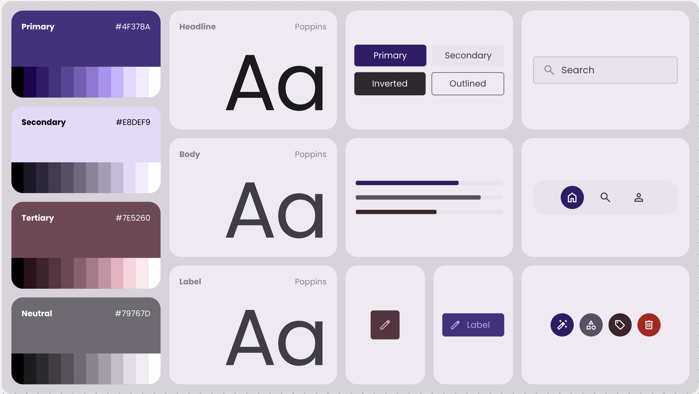

# iExpense Design System

An **architecture-compliant** design specification for Google Stitch (Stitch UI Kit), aligned with the `architecture/ui/` token system, the MVI Clean Architecture layer ([`theming-dynamic.md`](architecture/ui/theming-dynamic.md), [`theming-static.md`](architecture/ui/theming-static.md), [`reusable-ui-patterns.md`](architecture/ui/reusable-ui-patterns.md), [`ui-cheatsheet.md`](architecture/ui/ui-cheatsheet.md)), and the iExpense brand identity.

- **Source of truth for colors**: [`design/DESIGN-light.md`](design/DESIGN-light.md) & [`design/DESIGN-dark.md`](design/DESIGN-dark.md) Material Design 3 hex values.
- **Source of truth for tokens**: [`architecture/ui/reusable-ui-patterns.md`](architecture/ui/reusable-ui-patterns.md) and [`architecture/ui/theming-dynamic.md`](architecture/ui/theming-dynamic.md).
- **Source of truth for components**: [`architecture/ui/reusable-ui-patterns.md`](architecture/ui/reusable-ui-patterns.md), [`architecture/ui/ui-cheatsheet.md`](architecture/ui/ui-cheatsheet.md), [`architecture/ui/screen-architecture.md`](architecture/ui/screen-architecture.md).
- **Source of truth for typography**: Poppins (400 / 600 / 700), as specified in the architecture asset system.



[View live design preview on Stitch ↗](https://stitch.withgoogle.com/preview/12179744598835652443?node-id=f272d6584e5d4d7ea4c76db5a56934b0)

---

## 1. Colors — Semantic Tokens (`CustomThemeColors`)

All UI code must reference **semantic names** via `LocalCustomColors.current` (or `DesignSystem.colors`). Never hardcode hex values or import raw `ColorPalettes` constants in screen code.

### 1.1 Background

<table>
<tr><th>Token</th><th>Light</th><th>Dark</th><th>Stitch Equivalent</th><th>Usage</th></tr>
<tr><td><code>backgroundPrimary</code></td><td><code>#fdf7ff</code> <span style="display:inline-block;width:24px;height:24px;background:#fdf7ff;border:1px solid #cbc4d2;border-radius:3px;"></span></td><td><code>#141317</code> <span style="display:inline-block;width:24px;height:24px;background:#141317;border:1px solid #49454f;border-radius:3px;"></span></td><td><code>surface</code></td><td>App canvas, top-level screen background</td></tr>
<tr><td><code>backgroundSecondary</code></td><td><code>#f8f2fa</code> <span style="display:inline-block;width:24px;height:24px;background:#f8f2fa;border:1px solid #cbc4d2;border-radius:3px;"></span></td><td><code>#1c1b1f</code> <span style="display:inline-block;width:24px;height:24px;background:#1c1b1f;border:1px solid #49454f;border-radius:3px;"></span></td><td><code>surface-container-low</code></td><td>Cards, nav bars, elevated containers</td></tr>
<tr><td><code>backgroundTertiary</code></td><td><code>#f2ecf4</code> <span style="display:inline-block;width:24px;height:24px;background:#f2ecf4;border:1px solid #cbc4d2;border-radius:3px;"></span></td><td><code>#201f23</code> <span style="display:inline-block;width:24px;height:24px;background:#201f23;border:1px solid #49454f;border-radius:3px;"></span></td><td><code>surface-container</code></td><td>Modals, menus, bottom sheets</td></tr>
<tr><td><code>backgroundCardPrimary</code></td><td><code>#6750a4</code> <span style="display:inline-block;width:24px;height:24px;background:#6750a4;border:1px solid #cbc4d2;border-radius:3px;"></span></td><td><code>#d0bcff</code> <span style="display:inline-block;width:24px;height:24px;background:#d0bcff;border:1px solid #49454f;border-radius:3px;"></span></td><td><code>primary-container</code></td><td>Filled primary buttons, selected chips</td></tr>
<tr><td><code>backgroundCardSecondary</code></td><td><code>#e8def9</code> <span style="display:inline-block;width:24px;height:24px;background:#e8def9;border:1px solid #cbc4d2;border-radius:3px;"></span></td><td><code>#4a4359</code> <span style="display:inline-block;width:24px;height:24px;background:#4a4359;border:1px solid #49454f;border-radius:3px;"></span></td><td><code>secondary-container</code></td><td>Unselected chips, secondary cards</td></tr>
<tr><td><code>backgroundCardTertiary</code></td><td><code>#7e5260</code> <span style="display:inline-block;width:24px;height:24px;background:#7e5260;border:1px solid #cbc4d2;border-radius:3px;"></span></td><td><code>#efb8c8</code> <span style="display:inline-block;width:24px;height:24px;background:#efb8c8;border:1px solid #49454f;border-radius:3px;"></span></td><td><code>tertiary-container</code></td><td>FAB background, savings goal badges</td></tr>
<tr><td><code>backgroundSurfaceDim</code></td><td><code>#ded8e0</code> <span style="display:inline-block;width:24px;height:24px;background:#ded8e0;border:1px solid #cbc4d2;border-radius:3px;"></span></td><td><code>#141317</code> <span style="display:inline-block;width:24px;height:24px;background:#141317;border:1px solid #49454f;border-radius:3px;"></span></td><td><code>surface-dim</code></td><td>Low-luminance base surface</td></tr>
<tr><td><code>backgroundSurfaceBright</code></td><td><code>#fdf7ff</code> <span style="display:inline-block;width:24px;height:24px;background:#fdf7ff;border:1px solid #cbc4d2;border-radius:3px;"></span></td><td><code>#3a383d</code> <span style="display:inline-block;width:24px;height:24px;background:#3a383d;border:1px solid #49454f;border-radius:3px;"></span></td><td><code>surface-bright</code></td><td>Bright surface for elevated cards</td></tr>
</table>

### 1.2 Text

<table>
<tr><th>Token</th><th>Light</th><th>Dark</th><th>Stitch Equivalent</th><th>Usage</th></tr>
<tr><td><code>textPrimary</code></td><td><code>#1d1b20</code> <span style="display:inline-block;width:24px;height:24px;background:#1d1b20;border:1px solid #cbc4d2;border-radius:3px;"></span></td><td><code>#e5e1e7</code> <span style="display:inline-block;width:24px;height:24px;background:#e5e1e7;border:1px solid #49454f;border-radius:3px;"></span></td><td><code>on-surface</code></td><td>Primary readable text, headings, body</td></tr>
<tr><td><code>textSecondary</code></td><td><code>#494551</code> <span style="display:inline-block;width:24px;height:24px;background:#494551;border:1px solid #cbc4d2;border-radius:3px;"></span></td><td><code>#cac4d0</code> <span style="display:inline-block;width:24px;height:24px;background:#cac4d0;border:1px solid #49454f;border-radius:3px;"></span></td><td><code>on-surface-variant</code></td><td>Subtitles, metadata, placeholders</td></tr>
<tr><td><code>textTertiary</code></td><td><code>#686177</code> <span style="display:inline-block;width:24px;height:24px;background:#686177;border:1px solid #cbc4d2;border-radius:3px;"></span></td><td><code>#bab1ca</code> <span style="display:inline-block;width:24px;height:24px;background:#bab1ca;border:1px solid #49454f;border-radius:3px;"></span></td><td><code>on-secondary-container</code></td><td>Disabled labels, least-emphasis text</td></tr>
<tr><td><code>textPlaceholder</code></td><td><code>#948f9a</code> <span style="display:inline-block;width:24px;height:24px;background:#948f9a;border:1px solid #cbc4d2;border-radius:3px;"></span></td><td><code>#948f9a</code> <span style="display:inline-block;width:24px;height:24px;background:#948f9a;border:1px solid #49454f;border-radius:3px;"></span></td><td><code>outline</code></td><td>Hint text in input fields</td></tr>
<tr><td><code>textColorOnTheme</code></td><td><code>#ffffff</code> <span style="display:inline-block;width:24px;height:24px;background:#ffffff;border:1px solid #cbc4d2;border-radius:3px;"></span></td><td><code>#37265e</code> <span style="display:inline-block;width:24px;height:24px;background:#37265e;border:1px solid #49454f;border-radius:3px;"></span></td><td><code>on-primary</code></td><td>Text sitting on primary filled surfaces</td></tr>
<tr><td><code>textInverse</code></td><td><code>#f5eff7</code> <span style="display:inline-block;width:24px;height:24px;background:#f5eff7;border:1px solid #cbc4d2;border-radius:3px;"></span></td><td><code>#313034</code> <span style="display:inline-block;width:24px;height:24px;background:#313034;border:1px solid #49454f;border-radius:3px;"></span></td><td><code>inverse-on-surface</code></td><td>Text on inverted surfaces (snackbar)</td></tr>
<tr><td><code>textCritical</code></td><td><code>#ba1a1a</code> <span style="display:inline-block;width:24px;height:24px;background:#ba1a1a;border:1px solid #cbc4d2;border-radius:3px;"></span></td><td><code>#ffb4ab</code> <span style="display:inline-block;width:24px;height:24px;background:#ffb4ab;border:1px solid #49454f;border-radius:3px;"></span></td><td><code>error</code> / <code>on-error</code></td><td>Error messages, validation text</td></tr>
<tr><td><code>textOnTertiary</code></td><td><code>#ffffff</code> <span style="display:inline-block;width:24px;height:24px;background:#ffffff;border:1px solid #cbc4d2;border-radius:3px;"></span></td><td><code>#492532</code> <span style="display:inline-block;width:24px;height:24px;background:#492532;border:1px solid #49454f;border-radius:3px;"></span></td><td><code>on-tertiary</code></td><td>Text on tertiary filled surfaces</td></tr>
</table>

### 1.3 Border

<table>
<tr><th>Token</th><th>Light</th><th>Dark</th><th>Stitch Equivalent</th><th>Usage</th></tr>
<tr><td><code>borderPrimary</code></td><td><code>#7a7582</code> <span style="display:inline-block;width:24px;height:24px;background:#7a7582;border:1px solid #cbc4d2;border-radius:3px;"></span></td><td><code>#948f9a</code> <span style="display:inline-block;width:24px;height:24px;background:#948f9a;border:1px solid #49454f;border-radius:3px;"></span></td><td><code>outline</code></td><td>Primary dividers, active borders</td></tr>
<tr><td><code>borderSecondary</code></td><td><code>#cbc4d2</code> <span style="display:inline-block;width:24px;height:24px;background:#cbc4d2;border:1px solid #cbc4d2;border-radius:3px;"></span></td><td><code>#49454f</code> <span style="display:inline-block;width:24px;height:24px;background:#49454f;border:1px solid #49454f;border-radius:3px;"></span></td><td><code>outline-variant</code></td><td>Subtle separators, inactive borders</td></tr>
<tr><td><code>borderTertiary</code></td><td><code>#ece6ee</code> <span style="display:inline-block;width:24px;height:24px;background:#ece6ee;border:1px solid #cbc4d2;border-radius:3px;"></span></td><td><code>#2b292d</code> <span style="display:inline-block;width:24px;height:24px;background:#2b292d;border:1px solid #49454f;border-radius:3px;"></span></td><td><code>surface-container-high</code></td><td>Very faint separators</td></tr>
<tr><td><code>borderCritical</code></td><td><code>#ba1a1a</code> <span style="display:inline-block;width:24px;height:24px;background:#ba1a1a;border:1px solid #cbc4d2;border-radius:3px;"></span></td><td><code>#93000a</code> <span style="display:inline-block;width:24px;height:24px;background:#93000a;border:1px solid #49454f;border-radius:3px;"></span></td><td><code>error</code> (light) / <code>error-container</code> (dark)</td><td>Error validation borders</td></tr>
</table>

### 1.4 Icon

<table>
<tr><th>Token</th><th>Light</th><th>Dark</th><th>Stitch Equivalent</th><th>Usage</th></tr>
<tr><td><code>iconPrimary</code></td><td><code>#1d1b20</code> <span style="display:inline-block;width:24px;height:24px;background:#1d1b20;border:1px solid #cbc4d2;border-radius:3px;"></span></td><td><code>#e5e1e7</code> <span style="display:inline-block;width:24px;height:24px;background:#e5e1e7;border:1px solid #49454f;border-radius:3px;"></span></td><td><code>on-surface</code></td><td>Default icon tint</td></tr>
<tr><td><code>iconSecondary</code></td><td><code>#494551</code> <span style="display:inline-block;width:24px;height:24px;background:#494551;border:1px solid #cbc4d2;border-radius:3px;"></span></td><td><code>#cac4d0</code> <span style="display:inline-block;width:24px;height:24px;background:#cac4d0;border:1px solid #49454f;border-radius:3px;"></span></td><td><code>on-surface-variant</code></td><td>Meta icons, inactive nav icons</td></tr>
<tr><td><code>iconTertiary</code></td><td><code>#625b71</code> <span style="display:inline-block;width:24px;height:24px;background:#625b71;border:1px solid #cbc4d2;border-radius:3px;"></span></td><td><code>#ccc2dc</code> <span style="display:inline-block;width:24px;height:24px;background:#ccc2dc;border:1px solid #49454f;border-radius:3px;"></span></td><td><code>secondary</code></td><td>Decorative / illustrative icons</td></tr>
<tr><td><code>iconCritical</code></td><td><code>#ba1a1a</code> <span style="display:inline-block;width:24px;height:24px;background:#ba1a1a;border:1px solid #cbc4d2;border-radius:3px;"></span></td><td><code>#ffb4ab</code> <span style="display:inline-block;width:24px;height:24px;background:#ffb4ab;border:1px solid #49454f;border-radius:3px;"></span></td><td><code>error</code></td><td>Error state icons</td></tr>
<tr><td><code>iconOnTheme</code></td><td><code>#ffffff</code> <span style="display:inline-block;width:24px;height:24px;background:#ffffff;border:1px solid #cbc4d2;border-radius:3px;"></span></td><td><code>#37265e</code> <span style="display:inline-block;width:24px;height:24px;background:#37265e;border:1px solid #49454f;border-radius:3px;"></span></td><td><code>on-primary</code></td><td>Icons on primary buttons</td></tr>
<tr><td><code>iconOnTertiary</code></td><td><code>#ffffff</code> <span style="display:inline-block;width:24px;height:24px;background:#ffffff;border:1px solid #cbc4d2;border-radius:3px;"></span></td><td><code>#492532</code> <span style="display:inline-block;width:24px;height:24px;background:#492532;border:1px solid #49454f;border-radius:3px;"></span></td><td><code>on-tertiary</code></td><td>Icons on FAB / tertiary buttons</td></tr>
</table>

### 1.5 Accent / Theme (Primary)

<table>
<tr><th>Token</th><th>Light</th><th>Dark</th><th>Stitch Equivalent</th><th>Usage</th></tr>
<tr><td><code>themeColor</code></td><td><code>#4f378a</code> <span style="display:inline-block;width:24px;height:24px;background:#4f378a;border:1px solid #cbc4d2;border-radius:3px;"></span></td><td><code>#e9ddff</code> <span style="display:inline-block;width:24px;height:24px;background:#e9ddff;border:1px solid #49454f;border-radius:3px;"></span></td><td><code>primary</code></td><td>Key actions, active states, links</td></tr>
<tr><td><code>themeInverse</code></td><td><code>#cfbcff</code> <span style="display:inline-block;width:24px;height:24px;background:#cfbcff;border:1px solid #cbc4d2;border-radius:3px;"></span></td><td><code>#665590</code> <span style="display:inline-block;width:24px;height:24px;background:#665590;border:1px solid #49454f;border-radius:3px;"></span></td><td><code>inverse-primary</code></td><td>Inverse primary (snackbar action)</td></tr>
<tr><td><code>themeDim</code></td><td><code>#6750a4</code> <span style="display:inline-block;width:24px;height:24px;background:#6750a4;border:1px solid #cbc4d2;border-radius:3px;"></span></td><td><code>#d0bcff</code> <span style="display:inline-block;width:24px;height:24px;background:#d0bcff;border:1px solid #49454f;border-radius:3px;"></span></td><td><code>primary-container</code></td><td>Primary tonal surfaces</td></tr>
<tr><td><code>themeSurfaceTint</code></td><td><code>#6750a4</code> <span style="display:inline-block;width:24px;height:24px;background:#6750a4;border:1px solid #cbc4d2;border-radius:3px;"></span></td><td><code>#d0bcff</code> <span style="display:inline-block;width:24px;height:24px;background:#d0bcff;border:1px solid #49454f;border-radius:3px;"></span></td><td><code>surface-tint</code></td><td>Elevation overlay tint</td></tr>
</table>

### 1.6 Fixed Colors (Theme-Locked)

These do **not** swap with light/dark mode — they are locked for specific use cases (e.g., brand accent on both themes).

<table>
<tr><th>Token</th><th>Value</th><th>Preview</th><th>Usage</th></tr>
<tr><td><code>fixedPrimary</code></td><td><code>#e9ddff</code></td><td><span style="display:inline-block;width:24px;height:24px;background:#e9ddff;border:1px solid #cbc4d2;border-radius:3px;"></span></td><td>Primary fixed accent</td></tr>
<tr><td><code>fixedPrimaryDim</code></td><td><code>#cfbcff</code></td><td><span style="display:inline-block;width:24px;height:24px;background:#cfbcff;border:1px solid #cbc4d2;border-radius:3px;"></span></td><td>Primary dimmed accent</td></tr>
<tr><td><code>fixedOnPrimary</code></td><td><code>#22005d</code></td><td><span style="display:inline-block;width:24px;height:24px;background:#22005d;border:1px solid #cbc4d2;border-radius:3px;"></span></td><td>Text on fixed primary</td></tr>
<tr><td><code>fixedSecondary</code></td><td><code>#e8def9</code></td><td><span style="display:inline-block;width:24px;height:24px;background:#e8def9;border:1px solid #cbc4d2;border-radius:3px;"></span></td><td>Secondary fixed accent</td></tr>
<tr><td><code>fixedSecondaryDim</code></td><td><code>#ccc2dc</code></td><td><span style="display:inline-block;width:24px;height:24px;background:#ccc2dc;border:1px solid #cbc4d2;border-radius:3px;"></span></td><td>Secondary dimmed accent</td></tr>
<tr><td><code>fixedOnSecondary</code></td><td><code>#1e192b</code></td><td><span style="display:inline-block;width:24px;height:24px;background:#1e192b;border:1px solid #cbc4d2;border-radius:3px;"></span></td><td>Text on fixed secondary</td></tr>
<tr><td><code>fixedTertiary</code></td><td><code>#ffd9e3</code></td><td><span style="display:inline-block;width:24px;height:24px;background:#ffd9e3;border:1px solid #cbc4d2;border-radius:3px;"></span></td><td>Tertiary fixed accent</td></tr>
<tr><td><code>fixedTertiaryDim</code></td><td><code>#efb8c8</code></td><td><span style="display:inline-block;width:24px;height:24px;background:#efb8c8;border:1px solid #cbc4d2;border-radius:3px;"></span></td><td>Tertiary dimmed accent</td></tr>
<tr><td><code>fixedOnTertiary</code></td><td><code>#31101d</code></td><td><span style="display:inline-block;width:24px;height:24px;background:#31101d;border:1px solid #cbc4d2;border-radius:3px;"></span></td><td>Text on fixed tertiary</td></tr>
</table>

### 1.7 Inverse Surfaces

<table>
<tr><th>Token</th><th>Light</th><th>Dark</th><th>Stitch Equivalent</th><th>Usage</th></tr>
<tr><td><code>inverseSurface</code></td><td><code>#322f35</code> <span style="display:inline-block;width:24px;height:24px;background:#322f35;border:1px solid #cbc4d2;border-radius:3px;"></span></td><td><code>#e5e1e7</code> <span style="display:inline-block;width:24px;height:24px;background:#e5e1e7;border:1px solid #49454f;border-radius:3px;"></span></td><td><code>inverse-surface</code></td><td>Snackbar, toast background</td></tr>
<tr><td><code>inverseOnSurface</code></td><td><code>#f5eff7</code> <span style="display:inline-block;width:24px;height:24px;background:#f5eff7;border:1px solid #cbc4d2;border-radius:3px;"></span></td><td><code>#313034</code> <span style="display:inline-block;width:24px;height:24px;background:#313034;border:1px solid #49454f;border-radius:3px;"></span></td><td><code>inverse-on-surface</code></td><td>Text on inverse surface</td></tr>
</table>

### 1.8 Error System

<table>
<tr><th>Token</th><th>Light</th><th>Dark</th><th>Stitch Equivalent</th><th>Usage</th></tr>
<tr><td><code>error</code></td><td><code>#ba1a1a</code> <span style="display:inline-block;width:24px;height:24px;background:#ba1a1a;border:1px solid #cbc4d2;border-radius:3px;"></span></td><td><code>#ffb4ab</code> <span style="display:inline-block;width:24px;height:24px;background:#ffb4ab;border:1px solid #49454f;border-radius:3px;"></span></td><td><code>error</code></td><td>Error indicator, critical icon</td></tr>
<tr><td><code>onError</code></td><td><code>#ffffff</code> <span style="display:inline-block;width:24px;height:24px;background:#ffffff;border:1px solid #cbc4d2;border-radius:3px;"></span></td><td><code>#690005</code> <span style="display:inline-block;width:24px;height:24px;background:#690005;border:1px solid #49454f;border-radius:3px;"></span></td><td><code>on-error</code></td><td>Text on error solid</td></tr>
<tr><td><code>errorContainer</code></td><td><code>#ffdad6</code> <span style="display:inline-block;width:24px;height:24px;background:#ffdad6;border:1px solid #cbc4d2;border-radius:3px;"></span></td><td><code>#93000a</code> <span style="display:inline-block;width:24px;height:24px;background:#93000a;border:1px solid #49454f;border-radius:3px;"></span></td><td><code>error-container</code></td><td>Error tonal surface</td></tr>
<tr><td><code>onErrorContainer</code></td><td><code>#93000a</code> <span style="display:inline-block;width:24px;height:24px;background:#93000a;border:1px solid #cbc4d2;border-radius:3px;"></span></td><td><code>#ffdad6</code> <span style="display:inline-block;width:24px;height:24px;background:#ffdad6;border:1px solid #49454f;border-radius:3px;"></span></td><td><code>on-error-container</code></td><td>Text on error container</td></tr>
</table>

---

## 2. Typography (`AppTypography`)

**Single font family**: **Poppins** (400 Regular, 600 SemiBold, 700 Bold).

All styles below are complete `TextStyle` objects (not font-family overrides) and are accessed via `LocalAppTypography.current`.

### 2.1 Headings

| Token | Size | Weight | Line Height | Letter Spacing | M3 Equivalent | Usage |
|---|---|---|---|---|---|---|
| `heading3xl` | 57px | 400 | 64px | -0.25px | `displayLarge` | Total Balance, Monthly Summary |
| `heading2xl` | 45px | 400 | 52px | 0px | `displayMedium` | Dashboard hero titles |
| `headingXl` | 32px | 400 | 40px | 0px | `headlineLarge` | Section headers, page titles |
| `headingLg` | 28px | 600 | 36px | 0px | `headlineMedium` | Card titles, dialog headings |
| `headingMd` | 24px | 600 | 32px | 0px | `headlineSmall` | Sub-section headers |
| `headingSm` | 20px | 600 | 28px | 0px | `titleLarge` | Toolbar titles |

### 2.2 Titles

| Token | Size | Weight | Line Height | Letter Spacing | M3 Equivalent | Usage |
|---|---|---|---|---|---|---|
| `titleLg` | 22px | 500 | 28px | 0.15px | `titleLarge` | Card titles, list headers |
| `titleMd` | 16px | 500 | 24px | 0.15px | `titleMedium` | Transaction merchant name |
| `titleSm` | 14px | 500 | 20px | 0.1px | `titleSmall` | Metadata labels |
| `titleXs` | 12px | 500 | 16px | 0.5px | — | Overlines, captions |

### 2.3 Body

| Token | Size | Weight | Line Height | Letter Spacing | M3 Equivalent | Usage |
|---|---|---|---|---|---|---|
| `bodyLg` | 16px | 400 | 24px | 0.5px | `bodyLarge` | Paragraphs, descriptions |
| `bodyMd` | 14px | 400 | 20px | 0.25px | `bodyMedium` | Standard body, transaction meta |
| `bodySm` | 12px | 400 | 16px | 0.4px | `bodySmall` | Fine print, timestamps |
| `bodyXs` | 10px | 400 | 14px | 0.5px | — | Legal micro-copy |

### 2.4 Component Styles (Buttons, Chips, Inputs)

| Token | Size | Weight | Line Height | Letter Spacing | Usage |
|---|---|---|---|---|---|
| `componentExtraBoldLg` | 16px | 700 | 24px | 0.1px | Large primary CTA |
| `componentExtraBoldMd` | 14px | 700 | 20px | 0.1px | Primary button text |
| `componentExtraBoldSm` | 12px | 700 | 16px | 0.5px | Small bold labels |
| `componentExtraBoldXs` | 10px | 700 | 14px | 0.5px | Micro badges |
| `componentExtraBoldXxs` | 8px | 700 | 12px | 0.5px | Tiny indicators |
| `componentSemiBoldLg` | 16px | 600 | 24px | 0.1px | Large secondary CTA |
| `componentSemiBoldMd` | 14px | 600 | 20px | 0.1px | Secondary button text |
| `componentSemiBoldSm` | 12px | 600 | 16px | 0.5px | Chip text |
| `componentSemiBoldXs` | 10px | 600 | 14px | 0.5px | Small chip labels |
| `componentSemiBoldXxs` | 8px | 600 | 12px | 0.5px | Micro annotations |
| `componentRegularLg` | 16px | 400 | 24px | 0.5px | Large input text |
| `componentRegularMd` | 14px | 400 | 20px | 0.25px | Input text, body in cards |
| `componentRegularSm` | 12px | 400 | 16px | 0.4px | Helper text |
| `componentRegularXs` | 10px | 400 | 14px | 0.5px | Form micro-labels |
| `componentRegularXxs` | 8px | 400 | 12px | 0.5px | Minimal captions |

> **Scaling rule**: On mobile, clamp `heading3xl` (57px) down to `headingXl` (32px) to prevent horizontal clipping. Always maintain generous line-height for financial data readability.

---

## 3. Spacing (`Dimens`)

Use named `Dimens` tokens — **never** inline magic `dp` values.

### 3.1 Spacing Scale

| Token | Value | Usage |
|---|---|---|
| `spacingXs` | 4.dp | Tight grouping, icon-to-label |
| `spacingSm` | 8.dp | Button internal padding, related items |
| `spacingMd` | 12.dp | Card internal padding (tight) |
| `spacingLg` | 16.dp | Standard card padding, screen margin (mobile) |
| `spacingXl` | 24.dp | Section breaks, list item vertical padding |
| `spacing2xl` | 32.dp | Desktop margins, major section dividers |
| `spacing3xl` | 48.dp | Large section headers |
| `spacing4xl` | 64.dp | Hero spacing |

### 3.2 Radius Scale

| Token | Value | Usage |
|---|---|---|
| `radiusXs` | 4.dp | Chips, small indicators |
| `radiusSm` | 8.dp | Buttons, text fields |
| `radiusMd` | 12.dp | Transaction cards |
| `radiusLg` | 16.dp | Dashboard containers, dialogs |
| `radiusXl` | 24.dp | Bottom sheets, top edges |
| `radiusFull` | 9999.dp | FABs, avatars, pill chips |

### 3.3 Icon Sizes

| Token | Value | Usage |
|---|---|---|
| `iconSm` | 16.dp | Inline icons, micro actions |
| `iconMd` | 24.dp | Standard toolbar / list icons |
| `iconLg` | 32.dp | Section headers |
| `iconXl` | 48.dp | Empty state / illustration icons |

### 3.4 Button Heights

| Token | Value | Usage |
|---|---|---|
| `buttonXs` | 32.dp | Inline chip buttons |
| `buttonSm` | 36.dp | Compact buttons |
| `buttonMd` | 44.dp | Standard buttons |
| `buttonLg` | 48.dp | Primary CTAs |
| `buttonXl` | 56.dp | Hero actions |

### 3.5 Layout Grid

- **Base unit**: 4.dp
- **Mobile**: 4-column, 16px margins, 16px gutters
- **Tablet**: 8-column, 24px margins, 24px gutters
- **Desktop**: 12-column, 32px margins, 24px gutters
- **Max content width**: 1280px

---

## 4. Shape System

| Token | Radius | Example Components |
|---|---|---|
| `shapeSmall` | 8px | Buttons (`AppButton`), text fields (`AppTextField`), chips |
| `shapeMedium` | 12px | Transaction cards, small data containers |
| `shapeLarge` | 16px | Dashboard containers, dialogs, `ForbiddenContent` |
| `shapeExtraLarge` | 28px | Floating Action Button (FAB), top-level modal sheets |
| `shapeFull` | 9999px | Pill chips, circular avatars |

---

## 5. Elevation & Depth

Elevation is communicated through **Tonal Layers**, not heavy shadows.

| Level | Light Mode Surface | Dark Mode Surface | Usage |
|---|---|---|---|
| **Level 0** (Background) | `backgroundPrimary` (`#fdf7ff`) | `backgroundPrimary` (`#141317`) | App canvas |
| **Level 1** (Elevated) | `backgroundSecondary` (`#f8f2fa`) | `backgroundSecondary` (`#1c1b1f`) + 5–8% primary overlay | Cards, nav bars |
| **Level 2** (Raised) | `backgroundTertiary` (`#f2ecf4`) | `surface-container` (`#201f23`) | Bottom sheets, menus |
| **Level 3** (Modal) | `surface-container-high` (`#ece6ee`) | `surface-container-high` (`#2b292d`) | Dialogs, pickers |

- **Shadows**: Used sparingly on Level 2+. Soft, diffused ambient shadow with subtle primary tint.
- **FAB shadow** (dark mode): soft, high-spread shadow at 0.3 opacity.

---

## 6. Brand & Style

### 6.1 Personality

The brand is **professional, disciplined, and reliable** — designed to instill a sense of financial control and clarity. The target audience includes professionals and organized individuals who require a streamlined, high-efficiency interface for tracking personal capital.

### 6.2 Aesthetic

**Corporate Modern** with strict adherence to Material Design 3. The style is “Functional Elegance”: every visual cue serves a utility, ensuring the interface feels like a sophisticated tool rather than a decorative app.

### 6.3 Color Strategy

- **Primary Purple** (`themeColor`: `#4f378a` light / `#e9ddff` text-on in dark) = premium authority.
- **Secondary Muted Lavender** (`backgroundCardSecondary`) = approachable UI surfaces.
- **Tertiary Rose** (`backgroundCardTertiary`) = reserved for savings goals, highlighted categories, spend indicators.
- **Tonal Palettes** for state management (Hover, Focus, Pressed).
- All text-on-background pairings meet **WCAG AA** standards.

---

## 7. Component Specifications

These match the actual reusable components in `core/component/`. All components consume `DesignSystem.colors` and `DesignSystem.typography`.

### 7.1 `AppButton`

**Axes**: `Variant × Type × Size`

- **Variant**: `Primary` | `Secondary` | `Text`
- **Type**: `Default` | `Critical`
- **Size**: `XS` | `SM` | `MD` | `LG` | `XL`

**Style Matrix**

| Combination | Background | Content Color | Style |
|---|---|---|---|
| Primary + Default | `backgroundCardPrimary` | `textColorOnTheme` | `componentExtraBoldMd` |
| Primary + Critical | `error` | `onError` | `componentExtraBoldMd` |
| Secondary + Default | `backgroundSecondary` | `textPrimary` | `componentSemiBoldMd` |
| Text + Default | Transparent | `themeColor` | `componentSemiBoldMd` |

- **Corner radius**: `radiusSm` (8px)
- **Height**: `buttonMd` (44.dp) for MD, `buttonLg` (48.dp) for LG, `buttonXl` (56.dp) for XL
- **Touch target**: Minimum 48×48dp
- **States**: Focused uses **12% `themeColor` overlay**.
- **Leading / Trailing icons**: Optional `@Composable` slots, tinted `iconOnTheme` or `iconPrimary`.

### 7.2 `AppTextField`

**Signature fields**: `value`, `onValueChange`, `title`, `placeholder`, `errorMessage`, `size`

| State | Visual |
|---|---|
| **Idle** | `borderSecondary` border, `textPlaceholder` hint |
| **Focused** | `themeColor` border |
| **Error** | `borderCritical` border, `iconCritical` error icon, `textCritical` message below |
| **Disabled** | 38% opacity, `borderTertiary` |

- **Background**: `backgroundTertiary`
- **Text**: `textPrimary`
- **Label**: `textSecondary`, `titleSm`
- **Corner radius**: `radiusSm` (8px)
- **Padding**: `spacingLg` (16dp) horizontal, `spacingMd`(12dp) vertical

### 7.3 `AppPasswordTextField`

Extends `AppTextField` with:
- `isPasswordVisible: Boolean` parameter
- Toggle icon (`ic_eye_on` / `ic_eye_off`) tinted `iconSecondary`
- `VisualTransformation` switching: `PasswordVisualTransformation` ↔ `None`

### 7.4 Cards (Transaction / Dashboard)

- **Background**: `backgroundSecondary` (Level 1)
- **Corner radius**: `radiusMd` (12px)
- **Internal padding**: `spacingLg` (16dp)
- **Elevation**: Level 1 (tonal, no heavy shadow)
- **Content**:
  - Title: `headingLg` / `textPrimary`
  - Body: `bodyMd` / `textSecondary`
  - Amount: `componentExtraBoldLg` / `textPrimary`

### 7.5 `AppHeaderPage`

Material3 `TopAppBar` wrapper with back navigation.

- **Background**: `backgroundPrimary`
- **Title**: `headingSm`, centered, `textPrimary`
- **Nav icon**: `ic_arrow_left`, tinted `iconPrimary`
- **Height**: 64dp
- **Optional leading icon**: Replace back arrow with custom action.

### 7.6 `AppCenterHeaderPage`

- **Title**: centered, `headingSm`, `textPrimary`
- **No back button**
- **Background**: `backgroundPrimary`

### 7.7 `AppLoadingOverlay`

Full-screen semi-transparent overlay with `CircularProgressIndicator`.

- **Scrim**: 23% alpha black (`ColorPalettes.baseBlack.copy(alpha = 0.23f)`)
- **Spinner color**: `backgroundCardPrimary`
- **Spinner size**: `iconXl` (48dp)
- **Behavior**:
  - `visible = true`: overlay appears immediately
  - `blockTouch = true` (default): consumes all touch events (prevents double-submission)
- **Placement**: Inside `Box(Modifier.fillMaxSize())`, sibling to `Scaffold`, on top of content.

### 7.8 `AppOtpInputField`

6-digit OTP input with `BasicTextField`.

- **Box styling**: Square boxes, `radiusSm` border
- **Border colors** by state:
  - Unfocused / Idle → `borderSecondary`
  - Focused → `themeColor`
  - Error → `borderCritical`
  - Disabled → `borderTertiary`
- **Auto-advance**: Typing a digit moves focus to next box
- **Auto-delete**: Deleting an empty box moves focus to previous box
- **Box size**: 48×48dp, `componentExtraBoldLg` text

### 7.9 `ForbiddenContent`

Empty / forbidden state template for auth-gated screens.

- **Background**: `backgroundPrimary`
- **Icon**: 120dp, `iconSecondary`, centered
- **Header**: `headingLg`, `textPrimary`
- **Title**: `headingMd`, `textSecondary`
- **Description**: `bodyMd`, `textTertiary`
- **Primary button**: `AppButton` Primary + LG
- **Secondary button**: `AppButton` Secondary + MD (optional)

### 7.10 Chips (Expense Category)

- **Usage**: Expense filtering (e.g., “Food”, “Travel”).
- **Unselected**: Outlined, `borderSecondary`, `radiusSm`, `textSecondary`
- **Selected**: Filled, `backgroundCardSecondary`, `textPrimary`
- **Height**: `buttonXs` (32dp)
- **Text style**: `componentSemiBoldSm`

### 7.11 Transaction List Items

- **Row height**: Fixed **72dp**
- **Horizontal padding**: `spacingLg` (16dp)
- **Separator**: 1px, `borderSecondary`
- **Merchant name**: `titleMd`, `textPrimary`
- **Metadata (date/category)**: `bodySm`, `textSecondary`
- **Amount**: `componentSemiBoldMd`, right-aligned
  - Positive (income) → `themeColor`
  - Negative (spend) → `backgroundCardTertiary` / `textOnTertiary`

### 7.12 Floating Action Button (FAB)

- **Background**: `backgroundCardTertiary`
- **Icon color**: `iconOnTertiary`
- **Corner radius**: `radiusFull` (9999px, circular) or `shapeExtraLarge` (28px rounded square) per screen context
- **Size**: 56×56dp
- **Elevation**: Level 4, soft diffused shadow (0.3 opacity in dark)
- **Icon**: `ic_add` (add expense)

### 7.13 `AppToast` System

Three-layer toast architecture: `AppToast` (API) → `AppToastCard` (UI) → `AppToastHost` (Animator).

- **Position**: Bottom center of screen, inside root `Box`
- **Card background** by type:
  - `Success` → `ColorPalettes.Green600` / white text
  - `Error` → `ColorPalettes.Red600` / white text
  - `Warning` → `ColorPalettes.Orange500` / white text
  - `Info` → `ColorPalettes.Blue500` / white text
- **Text**: `bodyMd`, white
- **Animation**: `AnimatedVisibility` with `fadeIn() + slideInVertically` / `fadeOut() + slideOutVertically`
- **Queue**: `Channel` capacity 16, `DROP_OLDEST` overflow
- **Duration**: 3 seconds

### 7.14 Data Visualization (Charts)

- **Income series**: `themeColor` (primary purple)
- **Spend series**: `backgroundCardTertiary` (rose)
- **Stroke weight**: 2dp
- **Background**: `backgroundSecondary` at Level 1
- **Axis / Grid**: `borderSecondary`
- **Labels**: `bodySm`, `textSecondary`

---

## 8. State & Interaction Colors

These are **derived** from the semantic tokens above.

| State | Light Recipe | Dark Recipe |
|---|---|---|
| **Hover** | Surface + 4% `themeColor` | Surface + 8% `themeColor` |
| **Focus** | 12% `themeColor` overlay | 12% `themeColor` overlay |
| **Pressed** | Surface + 10% `themeColor` | Surface + 12% `themeColor` |
| **Dragged** | Surface + 8% `themeColor` | Surface + 16% `themeColor` |
| **Disabled** | 38% opacity on content | 38% opacity on content |
| **Ripple** | 12% `themeColor` | 12% `themeColor` |
| **Selected** | `backgroundCardPrimary` background + `textColorOnTheme` text | `backgroundCardPrimary` background + `textColorOnTheme` text |

---

## 9. Accessibility

- **Contrast**: Minimum 4.5:1 for normal text, 3:1 for large text / UI components.
- **Touch targets**: All interactive elements ≥ 48×48dp.
- **Focus indicators**: Visible focus rings using `themeColor` 12% overlay.
- **Text scaling**: Typography scales gracefully; clamp `heading3xl` to `headingXl` on mobile.
- **Screen reader**: All icons receive `contentDescription` via `stringResource()`.

---

## 10. Rules / Do's and Don'ts

| Do | Don't |
|---|---|
| Use `AppTheme` at the application root | Don't expose raw `ColorPalettes` constants in UI code |
| Read colors via `DesignSystem.colors` or `LocalCustomColors.current` | Don't hardcode `Color(...)` values in screens |
| Read typography via `DesignSystem.typography` or `LocalAppTypography.current` | Don't hardcode `TextStyle(...)` in screens |
| Use named `Dimens` tokens (`spacingLg`, `radiusMd`, `iconMd`) | Don't use magic `dp` values (e.g., `16.dp`) inline |
| Use `stringResource(Res.string.*)` for all user-facing text | Don't hardcode strings in composables |
| Use `painterResource(Res.drawable.ic_*)` for icons | Don't embed inline vector paths in composables |
| Apply `tint` to icons via `iconPrimary`, `iconSecondary`, etc. | Don't rely on intrinsic icon colors |
| Place `AppLoadingOverlay` as a sibling to `Scaffold` inside `Box` | Don't put loading overlay inside `Scaffold.content` |
| Use `AppToast.show(...)` for transient errors | Don't show inline error banners for API failures |
| Collect screen state with `collectAsStateWithLifecycle()` | Don't use plain `collectAsState()` for screen-level state |
| Dispatch Intents via `viewModel.dispatch(...)` | Don't use `viewModel.onIntent(...)` or call methods directly |
| Pass `state` and `onIntent` to stateless `Screen` composables | Don't pass ViewModels into child composables |
| Add new strings to **both** `values/strings.xml` and `values-en/strings.xml` | Don't leave English translations missing |

---

## 11. Architecture-to-Stitch Token Mapping

Use this table when configuring Stitch Theme Manager or Design Tokens plugin.

| iExpense `CustomThemeColors` Token | Stitch Equivalent | M3 Source | Light Hex | Dark Hex |
|---|---|---|---|---|
| `backgroundPrimary` | `bgSurfacePrimary` | `surface` | `#fdf7ff` | `#141317` |
| `backgroundSecondary` | `bgSurfaceSecondary` | `surface-container-low` | `#f8f2fa` | `#1c1b1f` |
| `backgroundTertiary` | `bgSurfaceTertiary` | `surface-container` | `#f2ecf4` | `#201f23` |
| `backgroundCardPrimary` | `bgBrandPrimary` | `primary-container` | `#6750a4` | `#d0bcff` |
| `backgroundCardSecondary` | `bgBrandSecondary` | `secondary-container` | `#e8def9` | `#4a4359` |
| `textPrimary` | `textPrimary` | `on-surface` | `#1d1b20` | `#e5e1e7` |
| `textSecondary` | `textSecondary` | `on-surface-variant` | `#494551` | `#cac4d0` |
| `textColorOnTheme` | `textOnBrand` | `on-primary` | `#ffffff` | `#37265e` |
| `textCritical` | `textCritical` | `error` | `#ba1a1a` | `#ffb4ab` |
| `borderPrimary` | `borderPrimary` | `outline` | `#7a7582` | `#948f9a` |
| `borderSecondary` | `borderSecondary` | `outline-variant` | `#cbc4d2` | `#49454f` |
| `borderCritical` | `borderCritical` | `error` / `error-container` | `#ba1a1a` | `#93000a` |
| `iconPrimary` | `iconPrimary` | `on-surface` | `#1d1b20` | `#e5e1e7` |
| `iconSecondary` | `iconSecondary` | `on-surface-variant` | `#494551` | `#cac4d0` |
| `iconCritical` | `iconCritical` | `error` | `#ba1a1a` | `#ffb4ab` |
| `themeColor` | `themeColor` / `accentPrimary` | `primary` | `#4f378a` | `#e9ddff` |
| `themeDim` | `accentPrimaryMuted` | `primary-container` | `#6750a4` | `#d0bcff` |
| `error` | `colorError` | `error` | `#ba1a1a` | `#ffb4ab` |
| `errorContainer` | `colorErrorSurface` | `error-container` | `#ffdad6` | `#93000a` |

---

## 12. Typography-to-Stitch Mapping

| iExpense `AppTypography` Token | Stitch Token | Size | Weight | Line Height | Use in Stitch |
|---|---|---|---|---|---|
| `heading3xl` | `heading-1` | 57px | 400 | 64px | Hero balance display |
| `heading2xl` | `heading-2` | 45px | 400 | 52px | Dashboard hero titles |
| `headingXl` | `heading-3` | 32px | 400 | 40px | Page titles, mobile hero |
| `headingLg` | `heading-4` | 28px | 600 | 36px | Card titles |
| `headingMd` | `heading-5` | 24px | 600 | 32px | Dialog titles |
| `headingSm` | `heading-6` | 20px | 600 | 28px | App bar titles |
| `titleLg` | `title-1` | 22px | 500 | 28px | Section headers |
| `titleMd` | `title-2` | 16px | 500 | 24px | List item titles |
| `titleSm` | `title-3` | 14px | 500 | 20px | Caption titles |
| `titleXs` | `overline` | 12px | 500 | 16px | Overlines |
| `bodyLg` | `body-1` | 16px | 400 | 24px | Paragraphs |
| `bodyMd` | `body-2` | 14px | 400 | 20px | Standard body |
| `bodySm` | `caption` | 12px | 400 | 16px | Timestamps, meta |
| `bodyXs` | `micro` | 10px | 400 | 14px | Legal fine print |
| `componentExtraBoldMd` | `button-primary` | 14px | 700 | 20px | Primary button text |
| `componentSemiBoldMd` | `button-secondary` | 14px | 600 | 20px | Secondary button text |
| `componentRegularMd` | `input-text` | 14px | 400 | 20px | Form input text |

> **Font**: Poppins ( weights: 400 Regular, 600 SemiBold, 700 Bold ). Load via `Res.font.poppins_regular`, `poppins_semibold`, `poppins_bold`.

---

## 13. File Architecture Reference

When generating or syncing Stitch tokens to the codebase, produce files in this structure:

```text
composeApp/src/commonMain/kotlin/com/example/core/component/theme/
├── ColorPalettes.kt          ← Raw hex constants (~150 colors)
├── CustomThemeColors.kt      ← Semantic data class + createTheme()
├── AppTypography.kt          ← Typography data class with Poppins
├── Dimens.kt                 ← Spacing, radius, icon, button tokens
└── Theme.kt                  ← AppTheme composable + LocalCustomColors / LocalAppTypography

composeApp/src/commonMain/kotlin/com/example/core/component/
├── button/
│   ├── AppButton.kt
│   └── AppButtonConfig.kt
├── textfield/
│   ├── AppTextField.kt
│   ├── AppTextFieldConfig.kt
│   ├── AppPasswordTextField.kt
│   └── AppPasswordTextFieldConfig.kt
├── header/
│   ├── AppHeaderPage.kt
│   └── AppCenterHeaderPage.kt
├── overlay/
│   └── AppLoadingOverlay.kt
├── toast/
│   ├── AppToast.kt
│   ├── AppToastCard.kt
│   └── AppToastHost.kt
└── misc/
    ├── AppOtpInputField.kt
    └── ForbiddenContent.kt
```
