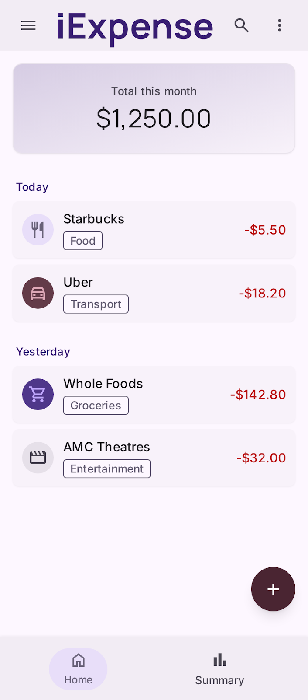
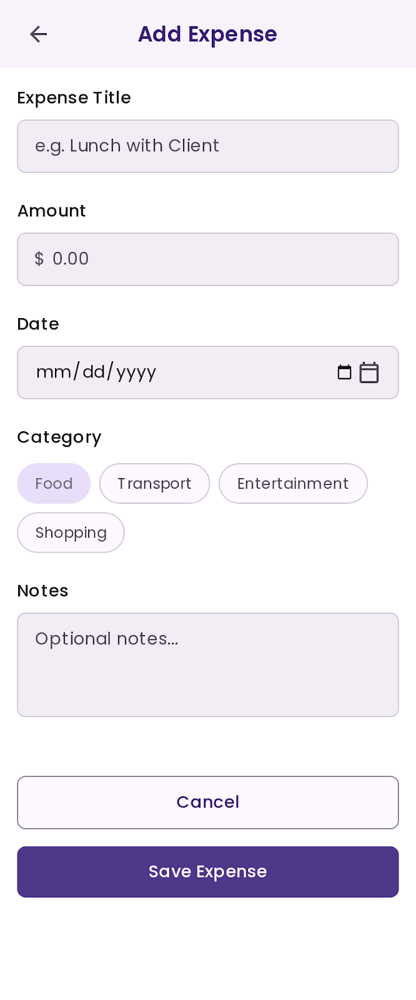
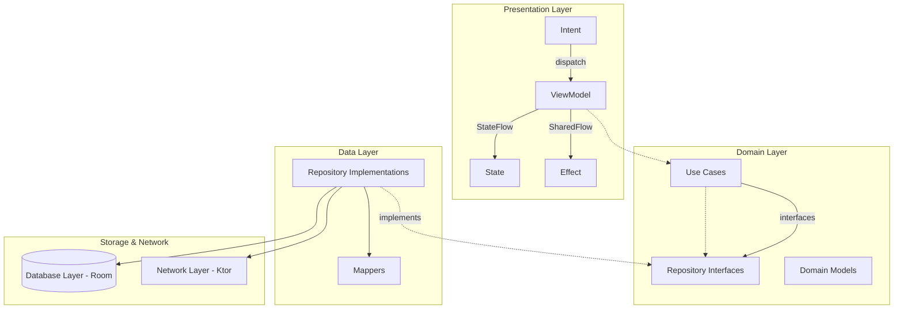

# iExpense - Personal Finance Tracker

A modern personal finance tracking application built with **Kotlin Multiplatform** and **Compose Multiplatform**, targeting **Android** and **iOS**. iExpense enables users to log daily expenses, categorise spending, and monitor monthly totals through a clean, intuitive interface.

## Features

- **Expense Tracking** - Log expenses with title, amount, date, category, and optional notes
- **Category Management** - Organise spending across six categories: Food, Transport, Utilities, Entertainment, Health, and Shopping
- **Monthly Summary** - View total spending for the current month at a glance
- **Date Grouping** - Transactions organised under relative date headers (Today, Yesterday, or formatted dates)
- **Dark Mode** - Full light and dark theme support via the design system
- **Offline-First** - All data persisted locally with Room; fully functional without network connectivity

## Screenshots

| Home Screen | Add Expense | Card Component |
|-------------|-------------|----------------|
|  |  |  |

[View live design preview on Stitch ↗](https://stitch.withgoogle.com/preview/12179744598835652443?node-id=f272d6584e5d4d7ea4c76db5a56934b0)

## Tech Stack

| Layer | Technology |
|-------|------------|
| **Language** | Kotlin 2.4 |
| **UI Framework** | Compose Multiplatform 1.10 + Material 3 |
| **Architecture** | Clean Architecture + MVI |
| **Dependency Injection** | Koin 4.2 |
| **Navigation** | JetBrains Navigation3 (multiplatform-nav3) |
| **Database** | Room KMP with bundled SQLite |
| **Networking** | Ktor HTTP Client |
| **Serialization** | Kotlinx Serialization |
| **DateTime** | Kotlinx Datetime |

## Architecture

iExpense follows **Clean Architecture** with **MVI (Model-View-Intent)** in the Presentation layer and an **Offline-First** data strategy, where Room serves as the Single Source of Truth.



### Layer Breakdown

| Layer | Location | Description |
|-------|----------|-------------|
| **Presentation** | `feature/**/` | MVI ViewModels, State, Intent, Effect, EffectHandler |
| **Domain** | `core/domain/` | Domain models, repository interfaces, use cases - zero external dependencies |
| **Data** | `core/data/` | Repository implementations, mappers |
| **Database** | `core/database/` | Room entities, DAOs, data sources |
| **Network** | `core/network/` | Ktor client, API services, DTOs |

### Screen Architecture

Every screen follows a three-layer composable structure:

```
Route → Screen → Content
```

- **Route** - Handles dependency injection, lifecycle wiring, effect collection, and initial intent dispatch
- **Screen** - Stateless composable receiving only `State` and `onIntent` callback
- **Content** - Pure UI arranged within a `Scaffold`

### State Management

- **State** - Single `data class` representing the entire screen state, exposed as `StateFlow<State>`
- **Intent** - `sealed interface` for all user actions, dispatched via `viewModel.dispatch(intent)`
- **Effect** - `sealed interface` extending `UiEffect` for one-shot side effects (navigation, error toasts), emitted through a `Channel`

## Design System

The project includes a comprehensive design system with:

- **Typography** - 28 named tokens across Headings, Titles, Body, and Component styles; Poppins font family
- **Colours** - Semantic colour tokens for Background, Text, Border, Icon, and Accent roles; primary purple palette
- **Spacing** - 8-stop scale from `spacingXs` (4dp) through `spacing4xl` (64dp)
- **Radius** - 6-stop scale from `radiusXs` (4dp) through `radiusFull`
- **Components** - Reusable `AppButton`, `AppTextField`, `AppLoadingOverlay`, `AppToast`, `ShimmerBox`, and more
- **Accessibility** - All text-on-background pairings meet WCAG AA standards

For detailed specifications, see [`DESIGN.md`](DESIGN.md).

## Getting Started

### Prerequisites

- **Android Studio** Ladybug or later (for Android development)
- **Xcode** 16 or later (for iOS development)
- **JDK** 17 or later

### Building

#### Android

```shell
./gradlew :composeApp:assembleDebug
```

On Windows:

```shell
.\gradlew.bat :composeApp:assembleDebug
```

#### iOS

1. Build the shared framework:
   ```shell
   ./gradlew :composeApp:linkDebugFrameworkIosSimulatorArm64
   ```
2. Open `iosApp/iosApp.xcodeproj` in Xcode
3. Select a simulator target and run

### Testing

```shell
./gradlew :composeApp:testDebugUnitTest
```

### Linting

```shell
./gradlew :composeApp:lint
```

## Project Structure

```
├── composeApp/
│   └── src/
│       ├── commonMain/kotlin/com/mobile/iexpense/
│       │   ├── feature/home/             # Home screen (MVI)
│       │   ├── feature/addexpense/       # Add Expense screen (MVI)
│       │   ├── core/domain/              # Domain models, use cases, repository interfaces
│       │   ├── core/data/                # Repository implementations, mappers
│       │   ├── core/database/            # Room DB, entities, DAOs
│       │   ├── core/network/             # Ktor API services, DTOs
│       │   ├── core/component/           # Reusable Compose components & theme
│       │   ├── core/common/              # Shared utilities (AppResult, BaseViewModel, etc.)
│       │   ├── core/navigation/          # NavKey definitions & serialization
│       │   └── di/                       # Koin module definitions
│       └── androidMain/                  # Android-specific implementations
├── iosApp/                               # iOS entry point & Xcode project
├── architecture/                         # Detailed architecture & pattern documentation
├── design/                               # Light/dark colour token source files
├── AGENTS.md                             # Agent instruction set
└── DESIGN.md                             # Design system specification
```

## Documentation

Comprehensive architecture and pattern documentation is available under the [`architecture/`](architecture/) directory:

### Core Architecture

| Document | Content |
|----------|---------|
| [`domain-layer.md`](architecture/domain-layer.md) | Domain models, repository interfaces, use cases, `AppResult`, `EntityCategory` |
| [`data-layer.md`](architecture/data-layer.md) | Repository patterns, mappers, `RemoteMediator`, `PagingSource` |
| [`database-layer.md`](architecture/database-layer.md) | Room entities, DAOs, data sources, `TypeConverter`, transaction provider |
| [`network-layer.md`](architecture/network-layer.md) | Ktor client setup, `safeApiCall`, API services, network data sources |
| [`presentation-layer.md`](architecture/presentation-layer.md) | MVI ViewModels, `State`, `Intent`, `Effect`, reducer pattern, `BaseViewModel` |
| [`dependency-injection.md`](architecture/dependency-injection.md) | Koin module structure, component registration patterns |
| [`room-kmp-setup.md`](architecture/room-kmp-setup.md) | Room KMP Gradle configuration, KSP registration, bundled SQLite driver |
| [`new-feature-cheatsheet.md`](architecture/new-feature-cheatsheet.md) | Step-by-step scaffold for adding new features from domain to UI |

### UI & Presentation Patterns

| Document | Content |
|----------|---------|
| [`navigation.md`](architecture/ui/navigation.md) | Navigation3 typed keys, `NavKey` serialization, backstack operations |
| [`screen-architecture.md`](architecture/ui/screen-architecture.md) | Route → Screen → Content three-layer composable structure |
| [`screen-state-collection.md`](architecture/ui/screen-state-collection.md) | `collectAsStateWithLifecycle` usage, state hoisting, lifecycle awareness |
| [`event-dispatching.md`](architecture/ui/event-dispatching.md) | Intent dispatching, Effect handling, MVI unidirectional flow |
| [`loading-error-content-states.md`](architecture/ui/loading-error-content-states.md) | Loading shimmer, error placeholders, empty states, content flip |
| [`paging-integration.md`](architecture/ui/paging-integration.md) | Paging integration with Compose `LazyList`, load states |
| [`reusable-ui-patterns.md`](architecture/ui/reusable-ui-patterns.md) | Design system, reusable components, resource management |
| [`theming-dynamic.md`](architecture/ui/theming-dynamic.md) | Dynamic accent theming with `ThemeManager` and runtime switching |
| [`theming-static.md`](architecture/ui/theming-static.md) | Single static theme (light/dark only) |
| [`ui-cheatsheet.md`](architecture/ui/ui-cheatsheet.md) | Quick-reference for scaffolding screens, components, and themes |
| [`testing-patterns.md`](architecture/ui/testing-patterns.md) | UI layer testing, test utilities, current coverage strategy |
| [`edge-cases.md`](architecture/ui/edge-cases.md) | Edge-case handling, advanced patterns, `BaseViewModel` hardening |

---

Learn more about [Kotlin Multiplatform](https://www.jetbrains.com/help/kotlin-multiplatform-dev/get-started.html).

## A Little Help Goes a Long Way ☕

The [`architecture/`](architecture/) documentation was built, battle-tested, and
rebuilt through hundreds of AI agent iterations. It was crafted using flagship models
**Kimi 2.6**, **DeepSeek Pro**, **GLM**, and **MiniMax**, each selected for their coding
specialisation to produce high-quality output. Every convention produces code that
compiles the first time. This is not free documentation. It is a precision tool that
cost significant time and compute to refine.

If you use or adapt these docs for your AI-assisted KMP workflows, or study them as a
Clean Architecture + MVI reference, your support is sincerely appreciated.

### Contribute

| Method | Details |
|--------|---------|
| **PayPal** | <a href="https://paypal.me/rhonyabdullah"></a><br>**@rhonyabdullah** |
| **Crypto (BEP20)** | `0x49fdc720e6ade8c6a2b13eeff54221b9a23fa173` |
| **QR Scan** | <a href="assets/crypto_wallet.jpg"></a> |

### Get Access

The [`architecture/`](architecture/) submodule is **private**. To get your git access token:

1. Contribute via one of the methods above
2. Confirm by reaching me through either:
   - [LinkedIn](https://www.linkedin.com/in/rhony)
   - [GitHub Discussions](../../discussions) (open a new thread)
3. I'll send your **git access token**

